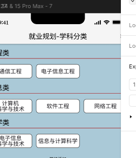

[TOC]


# 登陆注册

## 接口一：用户登录

### URL
`POST /login`

### 请求参数
```json
{
    "username": "string",  // 用户名，必填
    "password": "string"   // 密码，必填
}
```

### 响应参数
- 成功响应
```json
{
    "message": "Login successful",
    "session_token": "string"  // 会话令牌
}
```

- 失败响应
```json
{
    "error": "Invalid request"         // 请求格式错误
}
或
{
    "error": "Username not exist"  // 用户名不存在
}
或
{
    "error": "Username and password not match"  // 用户名和密码不匹配
}
或
{
    "error": "Failed to create session"  // 创建会话失败
}
```

### 功能描述
此接口用于用户登录。请求参数包含用户名和密码。系统会验证用户名和密码是否正确，如果正确则生成JWT会话令牌并返回。如果用户名或密码不正确，则返回错误信息。

### 示例请求
```sh
curl -X POST "http://localhost:8080/login" -H "Content-Type: application/json" -d '{"username": "testuser", "password": "testpassword"}'
```

### 示例响应
```json
{
    "message": "Login successful",
    "session_token": "eyJhbGciOiJIUzI1NiIsInR5cCI6IkpXVCJ9..."
}
```

## 接口二：用户注册

### URL
`POST /signup`

### 请求参数
```json
{
    "username": "string",  // 用户名，必填
    "password": "string",  // 密码，必填
    "email": "string",      // 邮箱，必填
    "captchaId": "string",  // 验证码ID，必填
    "value": "string"  // 验证码，必填
}
```

### 响应参数
- 成功响应
```json
{
    "message": "User signup successfully",
    "session_token": "string"  // 会话令牌
}
```

- 失败响应
```json
{
    "error": "Invalid request"         // 请求格式错误
}
或
{
    "error": "Username already exists" // 用户名已存在
}
或
{
    "error": "Failed to create user"  // 创建用户失败
}
或
{
    "error": "Failed to create session"  // 创建会话失败
}
```

### 功能描述
此接口用于用户注册。请求参数包含用户名、密码和邮箱。系统会检查用户名是否已经存在，如果不存在则创建新用户，并生成JWT会话令牌并返回。如果用户名已存在或创建用户失败，则返回错误信息。

### 示例请求
```sh
curl -X POST "http://localhost:8080/signup" -H "Content-Type: application/json" -d '{"username": "newuser", "password": "newpassword", "email": "newuser@example.com"}'
```

### 示例响应
```json
{
    "message": "User signup successfully",
    "session_token": "eyJhbGciOiJIUzI1NiIsInR5cCI6IkpXVCJ9..."
}
```

### 错误代码
- `Invalid request`: 请求格式错误，通常是缺少必填字段或字段类型错误。
- `Invalid username or password`: 用户名或密码错误。
- `Username already exists`: 用户名已存在。
- `Failed to create user`: 创建用户失败，通常是数据库操作失败。
- `Failed to create session`: 创建会话失败，通常是JWT生成失败。
- `Invalid captcha`: 验证码错误

---


以下是关于验证码获取的接口文档。该文档描述了生成验证码 ID 和获取验证码图片的 API 接口，包括请求方法、URL、参数、响应格式以及示例。

## 接口三：生成验证码 ID

### 请求

- **方法**：`GET`
- **URL**：`/captcha`

### 描述

此接口用于生成一个新的验证码 ID。

### 响应

- **状态码**：
  - `200 OK`：成功生成验证码 ID
  - `500 Internal Server Error`：服务器内部错误

- **响应体**：
  - **成功**：
    ```json
    {
      "captchaId": "some-valid-captcha-id"
    }
    ```
  - **失败**：
    ```json
    {
      "error": "Failed to generate captcha image"
    }
    ```

### 示例

#### 请求示例

```
GET /captcha
```

#### 响应示例

```json
{
  "captchaId": "abc123"
}
```

---

## 接口四: 获取验证码图片

### 请求

- **方法**：`GET`
- **URL**：`/captcha/:captchaId`

### 描述

此接口用于根据给定的验证码 ID 获取对应的验证码图片。

### 参数

- **路径参数**：
  - `captchaId` (string)：验证码 ID，必须由 `Createcaptchaid` 接口生成。

### 响应

- **状态码**：
  - `200 OK`：成功返回验证码图片
  - `500 Internal Server Error`：服务器内部错误，未能生成验证码图片

- **响应体**：
  - **成功**：返回验证码图片，内容类型为 `image/png`。
  - **失败**：
    ```json
    {
      "error": "Failed to generate captcha image"
    }
    ```

### 示例

#### 请求示例

```
GET /captcha/abc123
```


### 注意事项

1. 在调用 `GET /captcha/:captchaId` 接口之前，务必先调用 `GET /captcha` 接口以生成验证码 ID。

---

# 学习记录

## AddPlan API

### **接口描述**
`AddPlan` 接口用于添加用户学习记录。


### **请求 URL**
`POST /study/add-plan`

### **请求头**
- `Authorization: <token>`
  
  - 用于用户鉴权的 JWT token
  
    

### <span id="subject_map">科目表（待完善）</span>

SUBJECT_MAP = map[int]string{

  1: "Java",

  2: "C语言",

  3: "Python",

  4: "C++",

}

### **JSON请求格式**

```json
{
    "subject_id": 2, // 学习课目的id，前端需要同步建一个科目表MAP，必填
    "study_time": 17673868, // 用户所填入的日期，必填
    "spend_time": 1, // 学习时长，以小时为单位，必填
    "add_time": 17673770 // 用户点击添加的时间，必填
}
```

[科目表MAP](#subject_map)

### **响应示例**

- **成功响应**

```json
{
  "msg":"success"
}
```

- **错误响应**

```json
{
  "error": "参数格式错误"
}
```


## GetStudyData API

### **接口描述**

`GetStudyData` 接口获取用户学习数据。


### **请求 URL**

`GET /study/add-plan`


### **请求头**

- `Authorization: <token>`

  - 用于用户鉴权的 JWT token

    

### **请求参数**

```json
	无
```

[科目表MAP](#subject_map)

### **响应示例**

- **成功响应**

```json
{
    "average_time": "0.86",  // 本周平均学习时长
    "subjects_info": [
        {
            "data": [
                0,0,0,0,0,0,3
            ],  // 该科目七天内的学习时长
            "subject_id": 1,  // 科目ID
            "subject_name": "Java"  // 科目名称
        },
        {
            "data": [
                0,0,0,0,0,0,3
            ],
            "subject_id": 2,
            "subject_name": "C语言"
        }
    ],
    "xAxis": [
        "8.5",
        "8.6",
        "8.7",
        "8.8",
        "8.9",
        "8.10",
        "8.11"
    ]  // 前七天的日期
}
```

- **错误响应**

```json
{
  "error": "服务器内部错误"
}
```


---

# 新闻相关


## 获取新闻列表（包含图标，标题，简介，日期）
### 请求

- **方法**：`GET`
- **URL**：`/news/get-list`

### 描述

此接口用于获取新闻列表，无详细新闻内容，未做分页等处理。

### 参数
**请求头**: `Authorization: <token>`

  - 用于用户鉴权的 JWT token


### 响应

- **状态码**：
  - `200 OK`：成功返回新闻列表
  - `500 Internal Server Error`：查询数据库失败

- **响应体**：
  - **成功**：返回新闻列表。
    ```json
    {
      "news_id": 123,
	  "title": "news1",
      "intro": "震惊。。。",
	  "date": "17561688", //时间戳
	  "icon_url": "https://www.google.com",
    }
    {
      "news_id": 12,
	  "title": "news2",
      "intro": "简介简洁",
	  "date": "17561888", //时间戳
	  "icon_url": "https://www.microsoft.com",
    }
  - **失败**：
    ```json
    {
      "error": "查询数据库失败"
    }
    ```

### 示例

#### 请求示例

```
GET /news/get-list
```

---

## 获取详细新闻信息
### 请求

- **方法**：`GET`
- **URL**：`/news/get-detail`

### 描述

此接口用于获取新闻详细信息。

### 参数
**请求头**： `Authorization: <token>`

  - 用于用户鉴权的 JWT token

**请求体**：`news_id`
  - 在获取新闻列表时，对应新闻的id


### 响应

- **状态码**：
  - `200 OK`：成功返回新闻
  - `500 Internal Server Error`：查询数据库失败

- **响应体**：
  - **成功**：返回新闻列表。
    ```json
    {
      "news_id": 123,
	  "title": "news1",
      "body": "hi, im djfhajudghawu",
	  "date": "17561688", //时间戳
	  "icon_url": "https://www.google.com",
    }

  - **失败**：
    ```json
    {
      "error": "查询数据库失败"
    }
    ```

### 示例

#### 请求示例

```
GET /news/get-detail?news_id=12
```

# 就业规划-学科分类

## 获取专业列表

### **接口信息**
- **URL**: `/major/get-list`
- **请求方式**: `GET`
- **描述**: 获取专业列表，包括专业的ID、分类和名称。

### **请求**
#### **请求头**：

 `Authorization: <token>`

  - 用于用户鉴权的 JWT token

### **响应**
- #### **状态码**:
  
  - `200 OK`: 请求成功，专业列表包含在响应体中返回。
  - `500 Internal Server Error`: 服务器内部发生错误。
  
- #### **响应体**:

  - #### **成功响应示例** (`200 OK`):
    
    ```json
    {
      {
        "major_id": 1,
        "major_type": "信息类",
        "major_type_id": 1,  // 专业分类，0-工程类，1-信息类，2-理学类
        "major_name": "计算机科学与技术"
      },
      {
        "major_id": 2,
        "major_type": "工程类",
        "major_type_id": 0,  // 专业分类，0-工程类，1-信息类，2-理学类
        "major_name": "通信工程"
      }
    }
    ```
    
  - #### **错误响应示例** (`500 Internal Server Error`):
    
    ```json
    {
      "error": "服务器内部错误"
    }
    ```


---
## 获取详细专业信息

### 请求

- **方法**：`GET`
- **URL**：`/major/get-detail`

### 描述

此接口用于获取专业详细信息，包括评价等。

### 参数

**请求头**： `Authorization: <token>`

  - 用于用户鉴权的 JWT token

**请求体**：`major_id`

  - 在获取专业列表时，返回的major_id


### 响应

- **状态码**：

  - `200 OK`：成功返回专业信息
  - `500 Internal Server Error`：查询数据库失败

- **响应体**：

  - **成功**：返回专业信息。

    ```json
    {
        "commen_list": [
            {
                "body": "经历了今年的秋招，感觉目前通信行业确实陷入了周期性的寒冬，反而计算机相关的行业蓬勃发展，作为一个已经入坑的通信人只能期待5G能带给我们一点红利了。",
                "comment_id": 1,
                "star": 3,
                "title": "周期性的寒冬",
                "user": "精神孟家人"
            },
            {
                "body": "主要是数电、模电、高频电子线路、信号与系统、数字信号处理、嵌入式开发，单片机等。再往前就是微电子、半导体、集成电路。现在没什么纯硬件，都是软件驱动硬件，搞软硬结合。所以说，硬件专业=硬件+软件。",
                "comment_id": 2,
                "star": 2,
                "title": "搞电子",
                "user": "zzz"
            }
        ],
        "major_info": {
            "intro": "通信工程，英文名Communication Engineering，是电子工程的一个重要分支，也是电子信息类 子专业，更是一门重要的基础学科。",
            "major_id": 1,
            "name": "通信工程",
            "pic_url": "https://jf-open-prod-1301446188.cos.ap-guangzhou.myqcloud.com/media/S/23/0318/De58KONES8-WEVdYzFvu5jJS.jpg"
        }
    }
    ```

  - **失败**：

    ```json
    {
      "error": "查询数据库失败" //具体错误信息，如“major_id不能为空”，“major_id不能为空”
    }
    ```

### 示例

#### 请求示例

```
GET /major/get-detail?major_id=1
```

# 

<br>
<br>

以上就是接口文档的示例。如果需要添加更多细节或其他接口，请告诉我！